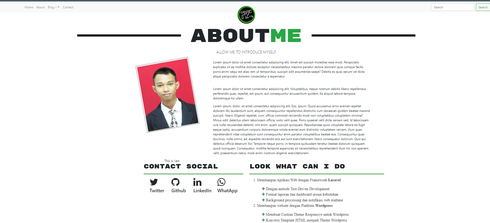

# CMS CI3 For Portofolio and Blog
Build with boostrap
 <br>
 
## Instruction QuickInstall
```
1.Extract and copy on your FTP
2.Setting application/config/database.php on your setting database and base url
3.running
